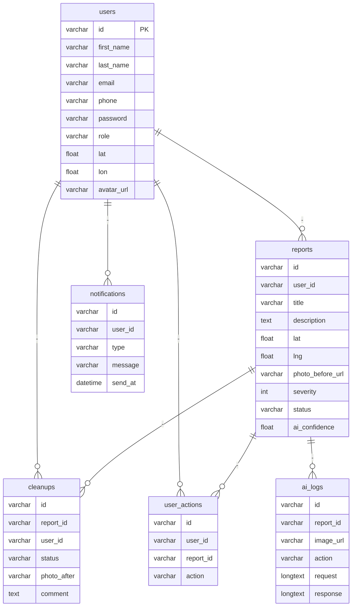
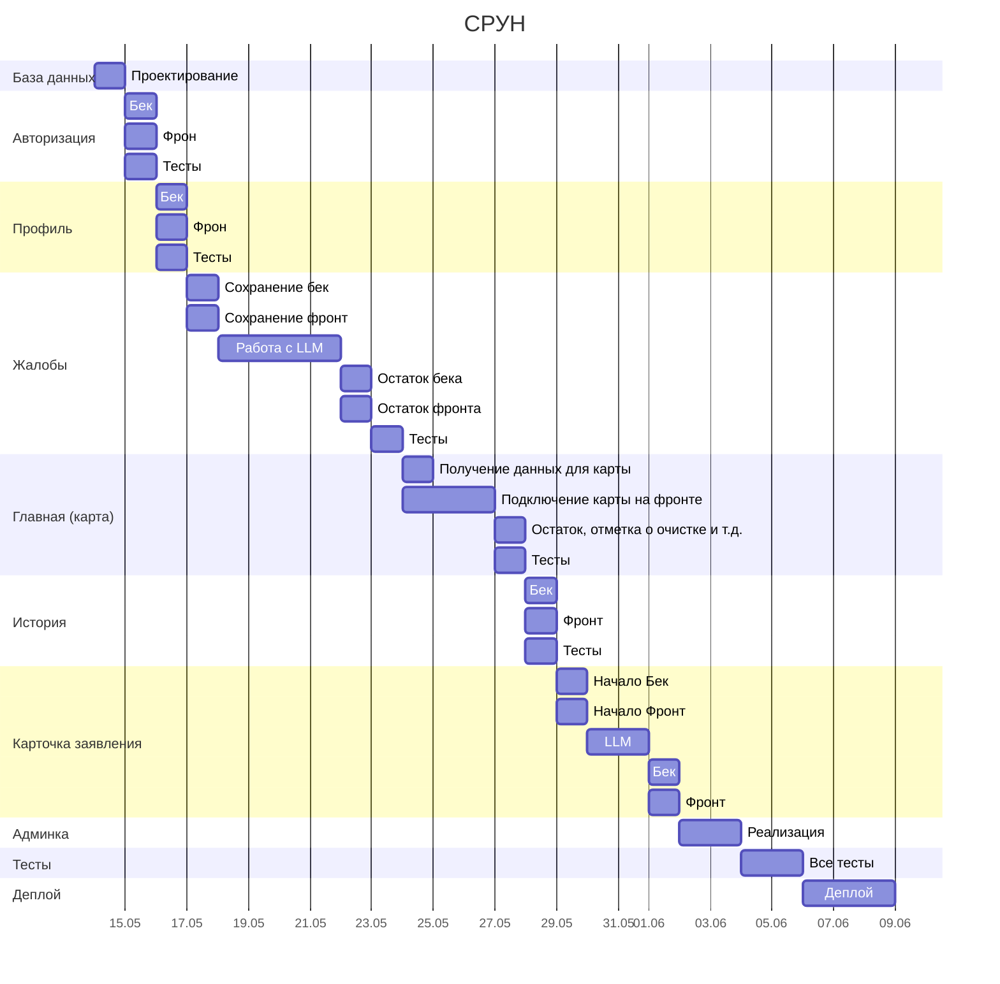

# ♻️ Система распознавания уличных нарушений (**СРУН**)

---

## 👩🏻‍💻 Стек технологий

| Слой   | Технологии |
| --- | --- |
| Frontend | React, TS, React Router |
| Backend | Node.js |
| DB | PostgreSQL |
| Инфраструктура | Docker |
| Документация | |
| Тесты | |
| API | Maps (yandex, 2gis, google), LLM |

---

## 📝 Описание проекта

### Идея 

Когда растаял снег, многие заметили, что на улицах нашего города появилось большое количество мусора. К сожалению, многим людям бывает сложно дойти до ближайшей урны, а в текущей ситуации уборка не всегда осуществляется ежедневно, поэтому мусор может лежать на улицах днями и даже неделями.

К счастью, существуют люди, которые добровольно убирают такие места, однако они не всегда знают, куда именно нужно идти, и могут тратить больше времени на поиск мусора, чем на саму уборку.

**СРУН** — это платформа, которая решает эту проблему.

**Пользователь** может: 

- отправить фотографию и указать местоположение загрязнённой территории — система автоматически определяет степень загрязнения
- просматривать карту с отмеченными местами загрязнений (с цветовой индикацией уровня загрязнения для удобства восприятия);
- отмечать место как очищенное, прикрепляя фотографию, а система сравнивает изображения и подтверждает, что это то же самое место и что оно действительно убрано.

**Модель может не всегда выдавать точную информацию, поэтому должна быть модерация**

**Модерация** может:

- Подтверждение ифнормации, валидация (точно ли место убрано, точно ли серьезность 8/10 и т.д.)

### Целевая аудитория

- **Добродетели** - люди, которых интересует чистота улиц и состояние окружающей среды. Они могут как самостоятельно убирать мусор, так и просто фиксировать загрязнённые места, загружая фотографии в систему.

---

## 🖥️ Ключевые экраны и функциональность

 > MVP проекта. По ходу выполнения может чутка поменяться

 

**Гость**

| Экран | Можно делать |
| --- | --- |
| Главная | Карта с маркерами |
| Общая статистика | Вывод общей статистики |
| Авторизация / Регистрация | Авторизироваться / Зарегестрироваться |

 

**Добродетель**

| Экран | Можно делать |
| --- | --- |
| Главная | Карта с маркерами. Возможность отметить что ты идешь убирать мусор. Просмотреть кто идет убирать мусор |
| Сообщить о мусоре | Загрузка фото и, геолокации и комментария при необходимости |
| Подтверждение уборки | Загрузка фотографии |
| Профиль | История уборок, редактирование профиля |

 

**Модератор**

| Экран | Можно делать |
| --- | --- |
| Панель админитратора - главная / Дашборд | Статистика: кол-во точек, карта и т.д. |
| Управление добродетелями | Просмотр статистики пользователя, изменение и т.д. |
| Управление точками | Удалить, сменить степень, закрыть, подтверждение |

 

**Администратор**

| Экран | Можно делать |
| --- | --- |
| Управление пользователями | Просмотр статистики пользователя, изменение и т.д. |

---

## 👨‍👩‍👦‍👦 User Stories

**Гость**

- Как гость, я хочу просматривать карту загрязнений, чтобы знать ситуацию в городе

**Добродетель**

- Как волонтёр, я хочу видеть карту загрязнённых мест, чтобы быстро находить, где нужна уборка

- Как волонтёр, я хочу фильтровать точки по уровню загрязнения, чтобы выбирать самые важные задачи

- Как волонтёр, я хочу отмечать место как убранное с фото, чтобы подтвердить выполненную работу

- Как волонтер, я хочу видеть свою статистику по убранным местам

- Как пользователь, я хочу получать уведомления о новых местах в нужном мне радиусе

**Модератор**

- Как администратор, я хочу просматривать статистику загрязнений, чтобы анализировать проблемные районы

- Как модератор, я хочу редактировать или удалять точки загрязнения, чтобы поддерживать актуальность данных

- Как модератор, я хочу управлять добродетелями и ролями, чтобы регулировать доступ к системе

**Администратор**

- Как администратор, я хочу управлять пользователями и ролями, чтобы регулировать доступ к системе

--- 

## 🧬 Сущности

| Сущность | Ключевые поля |
| --- | --- |
| `users` | id, first_name, last_name, email, phone, password, role, lat, lon, avatar_url |
| `reports` | id, user_id, title, description, lat, lng, photo_before_url, severity, status, ai_confidence |
| `cleanups` | id, report_id, user_id, status, photo_after, comment |
| `notifications` | id, user_id, type, message, send_at |
| `user_actions` | id, user_id, report_id, action, old_value, new_value |
| `ai_logs` | id, report_id, image_url, action, request, response |

---

# ERD

---

## Диаграмма Ганта

> Данная диаграмма может поменяться или сдвинуться. Но вроде как более менее адекватные сроки

